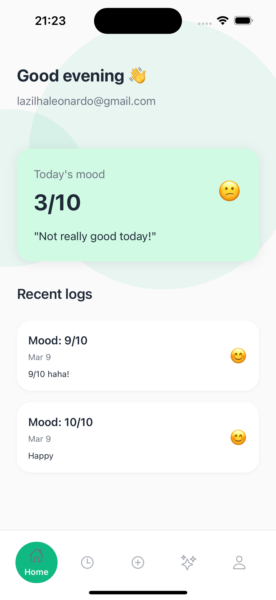
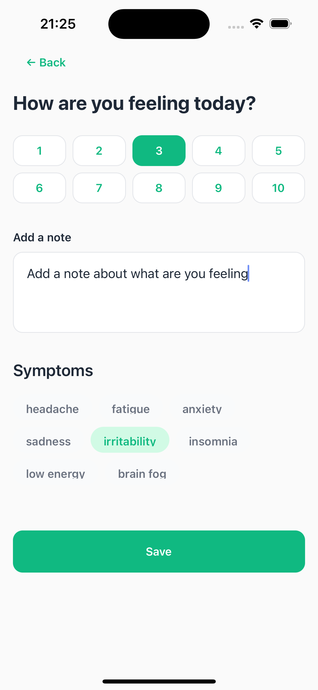
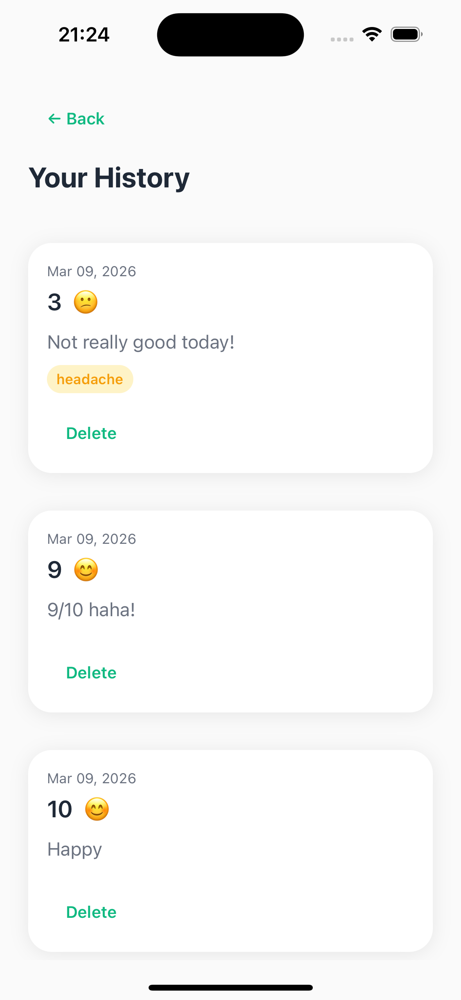
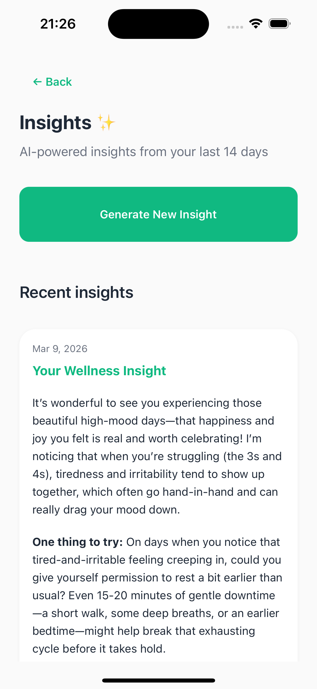
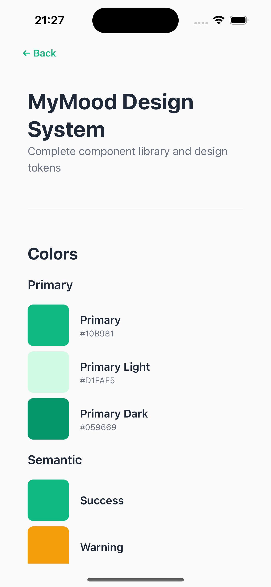

# Hey, Topflight! 🚀

> I built this app over a weekend to learn the exact stack you use — React Native, Supabase, and TypeScript. It's a simple mood & symptom tracker with AI-powered insights using the Anthropic API.

---

## About me

I'm Leonardo Lazilha, software developer from Brazil. I pick up new technologies fast.
I work daily with Java, Angular, SQL Server and React Native in my current role, and spend my weekends building side projects with React, Node.js, TypeScript, Supabase, and Next.js. I love learning by doing, which is exactly why I built MyMood before even having a first conversation with the Topflight team.
I'm excited about the possibility of joining Topflight because I genuinely enjoy building products that solve real problems. I'm comfortable working across the stack, adapting to new codebases quickly, and collaborating with teams remotely. I'm not looking for a comfortable job — I'm looking for a place where I can grow fast, contribute meaningfully, and help ship great products for your clients.

- 🌐 [leonardolazilha.dev](https://www.leonardolazilha.dev)
- 💼 [LinkedIn](https://www.linkedin.com/in/leonardo-lazilha-a52b7223a/)

---

## Why I built this

I applied for a position at Topflight Apps and wanted to show — not just tell — that I can work with your stack. So instead of just listing technologies on a resume, I built something real with them.

---

## Screenshots

<p float="left">
  
  
  
  
  
</p>

## What it does

- **Log your mood** (1–10) 
- **Track history** 
- **AI Insights** — personalized wellness insights using Claude (Anthropic API) via Supabase Edge Functions
- **Profile** (with design system showcase, only for show)

---

## Tech Stack

| Layer | Technology |
|---|---|
| Framework | React Native + Expo Router |
| Language | TypeScript |
| Styling | NativeWind + custom design tokens |
| Backend | Supabase (Auth + PostgreSQL + Edge Functions) |
| ORM | Drizzle ORM |
| AI | Anthropic API (claude-haiku) via Supabase Edge Function |
| Navigation | Expo Router (file-based) |

---

## Architecture

The app follows a 3-layer module architecture:

```
app/(app)/
  [module]/
    index.tsx                    ← Expo Router entry
    screens/[module]Screen.tsx   ← UI only
    hooks/use[Module].ts         ← state + logic
    services/[module]Service.ts  ← Supabase calls only
```

---

## Key Features & Implementation

###  Auth & Security
- Supabase email/password auth with persistent sessions
- Auth guard
- Row Level Security (RLS)

### AI Insights via Edge Function
- Supabase Edge Function (Deno) calls Anthropic API
- Claude generates a personalized wellness insight

### Design System
- Custom `Shared*` component library (`SharedButton`, `SharedCard`, `SharedText`, etc.)
- Design tokens for colors, spacing, typography, and shadows
- Styleguide screen available in the Profile tab for reference!

---

## Database Schema

```sql
logs (
  id uuid PK,
  user_id uuid FK,
  mood integer (1-10),
  note text,
  symptoms text[],
  created_at timestamp
)

insights (
  id uuid PK,
  user_id uuid FK,
  content text,
  generated_at timestamp
)
```
## Running locally

```bash
# Install dependencies
npm install

# Set up environment variables
cp .env.example .env
# Add your Supabase URL, anon key, and Anthropic API key

# Run migrations
npx drizzle-kit generate
npx drizzle-kit migrate

# Start the app
npx expo start
```

